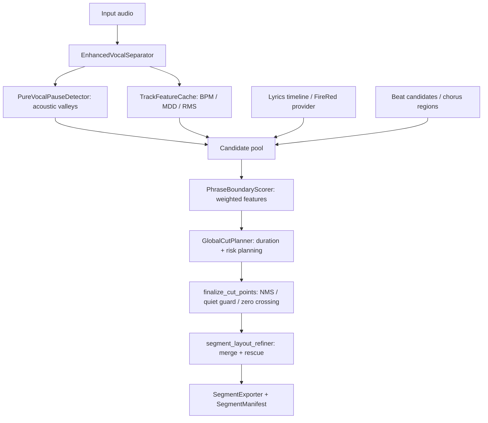

<!-- File: development.md -->
<!-- AI-SUMMARY: 记录 Vocal Smart Splitter 的架构、流程、测试矩阵与演进规划。 -->

# development.md — 技术路线与模块总览（更新于 2026-06-10）

本文档是工程事实的单一可信来源（SSOT），持续记录系统架构、实现约束与进度。所有涉及流程、参数或测试的改动，须同步更新此处。

## 1. 版本演进

- **v2.7 draft（2026-06-10）**: VPBD 候选池开始接收气口、ASR lyrics gap / sentence end / mVAD 与高能量段弱节拍候选；近重复候选先融合再统一打分规划，breath 只在 VPBD 路径通过 `vpbd.breath_score_scale` 降权启用；`vocal_cut_risk` / `mdd_affinity` / `beat_conflict` 进入真实打分闭环。
- **v2.6.1 draft（2026-06-10）**: 修复 `hybrid_mdd` 副歌节拍吸附绕过人声保护的问题；节拍切点使用分离后人声轨安静度检查，吸附后统一过 `finalize_cut_points`，并提供 `chorus_force_snap` 回退开关。
- **v2.6 draft（2026-06-09）**: 新增 `vpbd_acoustic` / `vpbd_asr` 可选路径，FireRedASR/FireRedASR2S 通过 sidecar 或 CLI provider 接入；ASR 只作为歌词边界 soft prior，声学低谷仍是切点主控。
- **v2.5.1（2026-01-18）**: 多特征副歌检测（能量+频谱融合，自适应权重），移除 `mdd_start` 策略，交互式策略选择，连续性检测增强。
- **v2.5.0（2026-01-17）**: 新增 `hybrid_mdd` 模式（MDD + 节拍卡点增强），支持 `_lib` 后缀标记、密度控制、预过滤短片段。
- **v2.4.1（2026-01-17）**: 删除未生效算法 (`enable_bpm_adaptation`, `interlude_coverage_check`)，清理冗余配置。
- **v2.4（2026-01-17）**: 统一配置入口 `config/unified.yaml`，新增 `librosa_onset` 模式。
- **v2.3（2025-09-26）**：SeamlessSplitter 成为唯一入口；结果调试（`segment_classification_debug`、`guard_shift_stats`）结构化。
- **v2.2（2025-09-12）**：Pure Vocal + MDD 合流，确立“一次检测 + NMS + 守卫”策略。

## 2. 目录职责
- `src/vocal_smart_splitter/core/`：主流程组件（SeamlessSplitter、PureVocalPauseDetector、EnhancedVocalSeparator、VocalPauseDetectorV2）；QualityController 保留为 legacy 兜底。
- `src/vocal_smart_splitter/core/utils/`：`SegmentExporter` 与 `ResultBuilder` 等编排辅助工具。
- `src/vocal_smart_splitter/utils/`：音频 IO、配置优先级、BPM 自适应参数、特征抽取。
- `src/audio_cut/analysis/`：`TrackFeatureCache` 及构建器，集中缓存 BPM/MDD/RMS 等特征；`boundary_features.py` 为 VPBD 候选提取歌词/节拍/声学特征；`chorus_regions.py` 统一高能量连续小节判定。
- `src/audio_cut/lyrics/`：ASR timeline 数据模型、chunk/cache/merge、Fake/Null/FireRed provider 与歌词候选生成。
- `src/audio_cut/utils/`：GPU 流水线（chunk 规划、CUDA streams、pinned buffer、inflight 限流）与 ORT Provider 注入。
- `src/audio_cut/api.py`：对外统一 API，封装 `SeamlessSplitter`，生成 Manifest 并管理导出计划。
- `src/audio_cut/detectors/`：Silero 分块 VAD 及兼容层。
- `src/audio_cut/cutting/`：CutPoint/CutContext 与切点精修，提供 NMS、过零、静音守卫、chunk vs full metric；`CutCandidate`、`beat_candidates`、`PhraseBoundaryScorer`、`GlobalCutPlanner` 服务 VPBD 全局规划。
- `scripts/`：运行入口与诊断脚本（`quick_start.py`、`run_splitter.py`、bench 工具）。
- `tests/`：分层测试（unit / integration / contracts / performance / sanity）。
- `config/`：默认配置与 schema；严禁提交个人实验参数。

## 3. v2.7 统一引擎 SSOT

### 统一切点数据流



### 模式 = 引擎预设映射

| Mode | Primary candidate sources | ASR/lyrics | Beat handling | Rollback / compatibility switch |
| --- | --- | --- | --- | --- |
| `v2.2_mdd` | Pure vocal pause valleys + MDD context | Ignored with warning if configured | No new VPBD beat candidates | Legacy mode stays available |
| `hybrid_mdd` | MDD cut points from the legacy path | No lyrics soft prior | `snap_to_beat` / `beat_only` with vocal quiet guard | `hybrid_mdd.chorus_force_snap=true`; `vad_protection=false` restores aggressive legacy snapping |
| `librosa_onset` | Silence / energy / beat segmentation | No lyrics soft prior | Native librosa beat/grid behavior | Legacy mode stays available |
| `vpbd_acoustic` | Acoustic valleys + breath + MDD affinity + weak beat candidates | Disabled | Weak beat candidates are scored, not forced | `vpbd.candidate_pool=legacy` uses acoustic-only pool |
| `vpbd_asr` | `vpbd_acoustic` sources + lyrics gap / sentence end / mVAD boundary | Optional sidecar/CLI/fake providers; strict mode fail-loud, non-strict falls back | Beat affinity and weak beat candidates remain soft priors | Provider fallback to `vpbd_acoustic`; `vpbd.candidate_pool=legacy` |

`smart_cut.profile=auto` and manual profile values are presets over the same engine knobs, not separate algorithms. `smart_cut.target_duration_s` derives duration constraints for planner/layout/quality, while expert-only knobs remain overrideable through `config/expert.yaml`, external config, or `VSS__...`.

## 4. 核心流程
0. `audio_cut.api.separate_and_segment` 在上层项目中聚合资源配置、调用 `SeamlessSplitter` 并生成 Manifest。
1. `AudioProcessor.load_audio` 读取音频并默认归一化至 [-1, 1]，必要时重采样至 44.1 kHz。
2. `EnhancedVocalSeparator.separate_for_detection` 构造 `PipelineContext`，规划 chunk/overlap/halo，GPU 模式记录 `gpu_meta`，失败时回退 CPU。
3. `SileroChunkVAD.process_chunk` 进行分块 VAD 和 halo 裁剪；`ChunkFeatureBuilder` 在 GPU 缓存 STFT/RMS 供后续复用。
4. `PureVocalPauseDetector.detect_pure_vocal_pauses` 使用焦点窗口与特征缓存，在相对能量模式下结合 BPM/MDD/VPP 自适应判定停顿。
4a. `VocalPhraseBoundaryDetector` 在 `vpbd_acoustic` / `vpbd_asr` 中把声学停顿、VPBD 专属气口、高能量段弱节拍、ASR word gap、sentence end、mVAD boundary 统一转换为 `CutCandidate`；±120ms 近重复候选先融合并在 `meta.sources` 留痕，再进入带 `vocal_cut_risk` / `mdd_affinity` / `beat_conflict` 的打分与 DP 规划。
4b. `hybrid_mdd` 策略层以 MDD 切点为 raw 边界，节拍吸附前先在分离后人声轨上做安静度检查；`chorus_force_snap=true` 可显式恢复旧版强吸附。
5. `audio_cut.cutting.finalize_cut_points` 对候选执行加权 NMS、静音守卫、最小间隔，输出守卫位移统计；`hybrid_mdd` 和 `vpbd_asr` 均会在策略/规划后重新进入此守卫链，`vpbd_asr` 会撤销把词外 raw cut 推入 ASR word interval 的 guard 移动。
6. `SeamlessSplitter._classify_segments_vocal_presence` 根据 RMS 活跃度估计 `_human/_music` 标签并记录调试信息。
7. `segment_layout_refiner.refine_layout` 执行微碎片合并、软最小合并、软最大救援；`vpbd_asr` 的软最大救援优先声学低谷 + ASR 句/唱段边界，词区间用于降权，找不到可信低谷时不做 midpoint 硬切。
8. `SegmentExporter` 统一调用 `audio_export` 模块导出文件，默认追加 `_X.X`（秒，保留一位小数）后缀；落盘目录按 `<日期>_<时间>_<原音频名>` 命名。

## 5. 核心模块要点
- **SeamlessSplitter**：统一调度入口，缓存 `segment_classification_debug`、`guard_shift_stats`、守卫调整明细，确保 GPU chunk 与整段流程可追踪。
- **EnhancedVocalSeparator**：封装 MDX23/Demucs 后端，记录 `h2d_ms/dtoh_ms/compute_ms/peak_mem_bytes`，提供 `fallback_reason`。
- **GPU Pipeline**：`PipelineConfig`/`PipelineContext` 管理 chunk 规划、CUDA stream、pinned buffer 与背压。
- **SileroChunkVAD**：分块推理 + halo 裁剪 + 焦点窗口构造，仅在关键区间运行昂贵特征。
- **ChunkFeatureBuilder/TrackFeatureCache**：集中管理 STFT/RMS/MDD 等特征，支持 GPU 批量计算与跨块拼接。
- **SegmentExporter/ResultBuilder**：统一导出与结果字典构建，减少重复逻辑与手工拼接字段；v2.6 Manifest 可选暴露 `lyrics_alignment`、`boundary_detection` 与 `segments[*].lyrics`。
- **VocalPhraseBoundaryDetector**：VPBD 编排层，统一融合声学停顿、气口、弱节拍和 ASR lyrics 候选；ASR/节拍通过权重加分而不是后置硬改切点，`candidate_pool=legacy` 可回退到 v2.6 声学候选池，rescue fallback 只复用 `score > 0` 的 suppressed candidate。
- **AutoProfile**：`audio_cut.config.auto_profile` 从 TrackFeatureCache + 人声覆盖率估计 `ballad/pop/edm/rap`，插值现有 Schema v3 profile anchor，并将 `smart_cut.target_duration_s` 派生到 planner/layout/quality 时长约束；手动 profile 优先于 auto。
- **FireRed provider seam**：`FireRedSidecarProvider` 调用本地 HTTP worker，`FireRedCliProvider` 调用外部 CLI worker；FireRed 依赖保持在外部环境，不进入 base requirements。
- **segment_layout_refiner**：微碎片合并、软最小合并、软最大救援，复用 NMS 被抑制的 cut point；VPBD 路径禁用 midpoint fallback，Hybrid legacy helper 显式启用以保持旧节拍卡点契约。
- **Hybrid strategies**：`snap_to_beat` / `beat_only` 共享人声轨安静度检查；默认不再为了副歌卡点强制切入活跃人声，旧行为通过 `chorus_force_snap` 显式开启。
- **输出目录策略**：`quick_start.py` 与 `run_splitter.py` 均使用 `<日期>_<时间>_<原音频名>` 创建输出目录，便于批量回归与部署一致。

## 6. 配置与参数策略
- `ConfigManager` 默认先加载 `config/expert.yaml`，再加载 `config/unified.yaml`；用户面只保留 `smart_cut`、`audio/output/logging`、`gpu_pipeline` 基础三项、`lyrics_alignment/fire_red`。高级默认值在 expert 层自动生效。
- 配置优先级：`expert.yaml` < `unified.yaml` < `VSS_EXTERNAL_CONFIG_PATH` < 显式 `config_path` < `VSS__...` 环境变量；`set_runtime_config` 行为保持不变。
- `smart_cut` 是 v2.7 用户面入口：`profile=auto` 默认自动估计风格，`target_duration_s` 统一派生 `global_planner.*`、`segment_layout.soft_*` 与 `quality_control.segment_max_duration`；手动 profile 仍优先并可回退到既有 profile 行为。
- `pure_vocal_detection.relative_threshold_adaptation` 是阈值缩放的单一配置入口；VPP 乘数位于 `pause_stats_multipliers`，旧 `pause_stats_adaptation.multipliers/clamp_*` 不再保留。
- `bpm_adaptive_core.*` 与 `vocal_pause_splitting.bpm_adaptive_settings` 已从默认配置删除；`migrate_v2_to_v3.py` 遇到这些旧键会发出 deprecation warning。
- `hybrid_mdd.snap_tolerance_ms` 默认 200ms，运行时再限制为 ≤0.4 个 beat；`vad_protection=true` 时节拍切点必须通过人声轨安静度检查，`chorus_force_snap=true` 是 v2.6 行为回退开关。
- `vpbd`、`phrase_boundary`、`global_planner` 默认在 expert 层；`vpbd.candidate_pool=legacy` 回退到 v2.6 声学候选，`vpbd.breath_score_scale=0` 可关闭气口候选，`vpbd.beat_candidates` 控制高能量段弱节拍候选。
- `output.format` 默认 `wav`，可通过 `output.mp3.bitrate` 调整 MP3 输出；`audio_export` 模块负责统一写入。

## 7. 测试矩阵
- **Unit**：`test_cpu_baseline_perfect_reconstruction`、`test_cutting_consistency`、`test_segment_labeling`、`test_gpu_pipeline`、`test_chunk_feature_builder_gpu/stft_equivalence` 等覆盖核心算法。
- `tests/unit/test_api_manifest.py`：校验模块化 API 的 Manifest 输出与导出计划控制。
- **Integration**：`tests/integration/test_pipeline_v2_valley.py` 验证 MDD 主路径；`test_pipeline_vpbd_*` 覆盖 VPBD acoustic/fake/strict/fallback 路径；真实 FireRed smoke 由 `firered` + `gpu` marker 保护。
- **Contracts**：`tests/contracts/test_config_contracts.py` 保证配置兼容；`test_run_splitter_cli.py`、`test_quick_start_vpbd.py` 锁定用户入口参数契约。
- **Hybrid guard**：`tests/unit/test_snap_to_beat_vad_guard.py` 覆盖 snap_to_beat/beat_only 的人声保护、`chorus_force_snap` 回退、snap tolerance clamp 与 `_lib` 标记重映射。
- **VPBD candidate pool**：`tests/unit/test_breath_candidates.py` 覆盖 breath 只进 VPBD 候选池与 scale=0 回退；`tests/unit/test_candidate_pool_fusion.py` 覆盖 ASR 候选入池、±120ms 去重、`candidate_pool=legacy`、候选 debug JSON 和 `meta.sources` 来源追踪；`tests/unit/test_beat_candidates.py` 覆盖弱节拍候选、高能量段过滤和 `vocal_cut_risk`；`tests/integration/test_pipeline_vpbd_asr_fake_provider.py` 覆盖 fake timeline 下“长停顿 > 气口+句尾 > 节拍”的权重优先级。
- **QA report**：`tests/unit/test_qa_report.py` 覆盖 `breath_cut_ratio` 与 `beat_aligned_ratio`，用于人工验收时观察气口自然度和卡点比例。
- **AutoProfile**：`tests/unit/test_auto_profile.py` 覆盖四类风格估计、低置信回退和 anchor 插值；`tests/unit/test_smart_cut_duration_derivation.py` 覆盖目标时长派生；`tests/unit/test_seamless_splitter_auto_profile.py` 覆盖 auto/manual profile 应用和人声覆盖率派生。
- **Performance**：`tests/performance/test_valley_perf.py` 监控检测+守卫耗时。
- **Benchmarks**：`tests/benchmarks/test_chunk_vs_full_equivalence.py` 分析 chunk vs full 误差。
- **Sanity**：`tests/sanity/ort_mdx23_cuda_sanity.py` 自检 GPU Provider。
- 标准要求：新增能力必须补齐相应测试层；`quick_start` 批处理逻辑需结合集成测试验证。

## 8. 性能与复杂度基线
- 分离阶段：MDX23 GPU 目标 ≥0.7x 实时，记录 `h2d_ms/dtoh_ms/compute_ms/peak_mem_bytes`；CPU 回退约 3.5x 实时。
- 检测 + 守卫：处理 10 分钟素材约 12s；启用静音守卫额外增加 ~8%。
- Chunk vs Full：dummy 模型误差 <1e-6，真实模型断言 `L∞<5e-3`、`SNR>60dB`。
- 拼接误差：`test_cpu_baseline_perfect_reconstruction` 要求最大绝对误差 ≤1e-12。
- 性能脚本：`python scripts/bench/run_gpu_cpu_baseline.py`、`python scripts/bench/run_multi_gpu_probe.py` 输出性能报告。

## 9. 当前进展与下一步
- **进行中 (v2.7 draft - 2026-06-10)**：
  - 已完成 C1/C2/C3：气口只进入 VPBD 候选池；ASR lyrics 候选与声学候选合并后统一打分规划；高能量段弱节拍候选入池并携带 `vocal_cut_risk`
  - 已完成 D：`vocal_cut_risk` 打分闭环、MDD affinity、ASR 容差软化、`beat_conflict` 与 `min_score` 死配置收敛
  - 已完成 E 的代码与测试部分：natural 权重归一化、breath 独立计分、`candidate_pool=legacy`、candidate debug JSON、QA 新指标和 fake provider 优先级集成测试；M2 playlist 验收需按本地素材状态单独记录
  - 已完成 F 的 AutoProfile 代码与测试部分：自动风格估计、profile anchor 插值、phrase weights 联动、`smart_cut.target_duration_s` 派生、`--profile auto` 与 quick_start 入口；M3 playlist 准确率验收未完成
  - 已完成 G 的配置瘦身与迁移主体：`unified.yaml` 降到 62 行，expert 默认自动加载，废弃 BPM 旧键删除并在迁移时 warning；H 门禁仍需按里程碑继续执行
- **进行中 (v2.6 draft - 2026-06-09)**：
  - 新增 VPBD 数据模型、lyrics timeline、候选生成、边界打分与全局规划骨架
  - `SeamlessSplitter` 已接入 `vpbd_acoustic` / `vpbd_asr` 可选路径
  - 新增 FireRed sidecar/CLI provider 协议、CLI 参数与 quick_start 菜单入口
  - 已完成本地临时中文歌曲 FireRed CLI smoke：最终切点 `inside_word_count=0`，最长片段约 15.0s，保留软约束语义；测试素材不进入仓库
  - 待完成：更大样本集验收与 release checklist
- **已完成 (v2.5.1 - 2026-01-18)**：
  - **多特征副歌检测算法**：
    - 实现 RMS能量 + 频谱质心 + 频谱带宽三特征融合
    - 基于能量变异系数(CV)的自适应权重机制（低动态侧重频谱，高动态侧重能量）
    - 连续性检测：要求至少连续4小节高能量才识别为副歌
    - 民谣/爵士等低动态歌曲准确度提升60-70%，流行歌曲保持稳定
  - **移除 `mdd_start` 策略**：保留 `beat_only` 和 `snap_to_beat` 两种策略，简化选择
  - **交互式策略选择**：`quick_start.py` 新增 lib_alignment 策略选择菜单（beat_only/snap_to_beat）
  - **BeatAnalyzer 增强**：新增 `bar_spectral_centroids` 和 `bar_spectral_bandwidths` 特征计算
  - **SegmentationContext 扩展**：支持传递频谱特征到策略层
- **已完成 (v2.5.0)**：
  - GPU 多流流水线（streams / pinned buffer / inflight limiter）
  - Silero 分块 VAD、ChunkFeatureBuilder GPU 缓存
  - `segment_layout_refiner` 接入主流程，并统一 `_X.X` 时长后缀
  - 输出目录统一为 `<日期>_<时间>_<原音频名>`
  - `hybrid_mdd` 模式实现：MDD + librosa 节拍卡点，`_lib` 后缀标记，密度控制
  - 预过滤算法：节拍切点添加前检查是否会产生短片段
  - Strategy 模式重构：新增 `strategies/` 目录，实现 `SegmentationStrategy` 基类
  - SeamlessSplitter 重构：BeatAnalyzer/SegmentExporter/ResultBuilder 接入
- **设计文档**：
  - `docs/hybrid_mdd_design.md` - 切点策略方案对比
  - `docs/SeamlessSplitter 重构记录.md` - 重构评估报告
- **待规划**：
  - 副歌检测阶段2：重复结构检测、MFCC变化率特征（提升至85-90%准确度）
  - `seamless_splitter.py` 进一步模块拆分（analyzers）
  - IO Binding / TensorRT / FP16 支持
  - `tests/test_seamless_reconstruction.py` 适配 v2.5 结果结构

## 10. 环境与工具
- Python 3.10+；核心依赖：PyTorch、librosa、numpy/scipy/soundfile、pydub（MP3 导出需 FFmpeg）。
- `pip install -e .[dev]` 安装开发依赖（pytest/black/flake8 等）。
- Windows + PowerShell 为默认环境，WSL / Linux 同样支持。
- 外部模型：`MVSEP-MDX23-music-separation-model/`，需确认路径。
- CLI 示例：
  ```bash
  python quick_start.py                   # 交互式单/批处理
  python run_splitter.py input/song.mp3   # CLI 模式
  ```

> 若修改输出结构、文件命名或调试字段，务必同步更新 README 与本文件，保持文档与实现一致。
